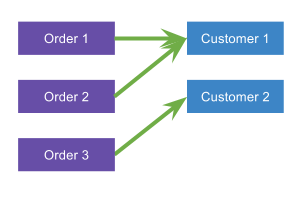

# Relations

Objects may reference other objects, for example using a simple reference or a list of objects. In database terms, we call those references **relations**. The object defining the relation we call the **source** object, the referenced object we call **target** object. So the relation has a direction.

If there is one target object, we call the relation **to-one.** And if there can be multiple target objects, we call it **to-many**. 


Relations are currently initialized eagerly - i.e. the targets are loaded & as soon as the source object is read from the database. This might change in the future to lazy-loading by default, to increase performance when you don't need the referenced data.


## To-One Relations



You define a to-one relation using \`link\` annotation on a field that is a pointer or value type of another entity. Consider the following example - the Order entity has a to-one relation to the Customer entity.



```go
//go:generate objectbox-gogen

type Order struct {
	Id        uint64
	Customer  *Customer `link`
	Notes     string
}

type Customer struct {
    Id    uint64
    Name  string
}
```



Now let's add a customer with a few orders.



```go
// note that here we're creating a new customer
// but we could have also reused an existing one
var customer = &model.Customer{Name: "ACME Inc."}

var box = model.BoxForOrder(ob)

// Insert a new order. ObjectBox also inserts the customer automatically 
// because it's new (customer.Id == 0 at this point)
box.Put(&model.Order{
    Notes: "first order, new customer",
    Customer: customer,
})

...

// Add another order. Now the customer.Id is already > 0 
// so it's not inserted again, just referenced
box.Put(&model.Order{
    Text: "second order, existing customer",
    Customer: customer,
})
```



After the `box.Put` has been executed on the first order, the `customer.Id` would be `1` because we're using pointers \(`Customer *Customer` field\) so Put could update the variable when it has inserted the Customer. Note that this wouldn't be possible if we were using copies \(`Customer Customer` field\) and in that case you should insert the customer manually into it's box first \(or use an existing customer selected from the database\).

We can also **read**, **update** or **remove** the relationship to a customer:



```go
var box = model.BoxForOrder(ob)

order, _ := box.Get(1) // Read
// at this point, order.Customer is already loaded automatically (eager-loading)

order.Customer = nil   // Remove the relation
box.Put(order)         // Update

// or do an update to a different customer
customers, _ := model.BoxForCustomer(ob).GetAll()
order.Customer = customers[2]
box.Put(order)
```



Note that removing the relation does not remove the customer from the database, it removes only the link between this specific order and the customer.

## To-Many Relations

There is a slight difference if you require a one-to-many \(1:N\) or many-to-many \(N:M\) relation.   
A 1:N relation is like the example above where a customer can have multiple orders, but an order is only associated with a single customer. An example for an N:M relation are students and teachers: students can have classes by several teachers but a teacher can also instruct several students.

### One-to-Many \(1:N\)


Currently, one-to-many relations are defined implicitly as an opposite relation to a [to-one relation ](relations.md#to-one-relations)as defined above. This is useful for queries, e.g. to select all customers with an order placed within the last seven days.

### Many-to-Many \(N:M\)


To define a to-many relation, you can use a slice of entities - no need to specify the `link` annotation this time. They're stored when you put the source entity and loaded when you read it from the database

Assuming a students and teachers example, this is how a simple student class that has a to-many relation to teachers can look like:



```go
//go:generate objectbox-gogen

type Teacher struct {
	Id    uint64
	Name  string
}

type Student struct {
    Id        uint64
    Name      string
    Teachers  []*Teacher
}
```



**Adding** the teachers of a student works exactly like with a list:



```go
var teacher1 = &model.Teacher{Name: "John Wise"}

var teacher2 = &model.Teacher{Name: "Peter Clever"}

var student1 = &model.Student{
    Name: "Martin Curious",
    // we can create the slice in place
    Teachers: []*model.Teacher{teacher1, teacher2},
}

// or append to it
var student2 = &model.Student{Name: "Earl Eager"}
student2.Teachers = append(student2.Teachers, teacher2)

// puts students and teachers
var box = model.BoxForStudent(ob)
box.Put(student1)
box.Put(student2)
```



Similar to the to-one relations, related entities are inserted automatically if they are new. If the teacher entities do not yet exist in the database, the ToMany will also put them. If they already exist, the ToMany will only create the relation \(but not put them\). 

To **get** the teachers of a student we just access the list:



```go
var student1 = model.BoxForStudent(ob).Get(1);

for _, teacher := range student1.Teachers {
    fmt.PrintLn(teacher.Name)
}
```



**Remove** and **update** work similar to insert - you just change the `student.Teachers` slice to reflect the new state \(i.e. remove element, add elements, etc\) and `box.Put(student)`. Note that if you want to change actual teacher data \(e.g. change teachers name\), you need to update the teacher entity itself, not just change it in one of the student.Teachers slice.

